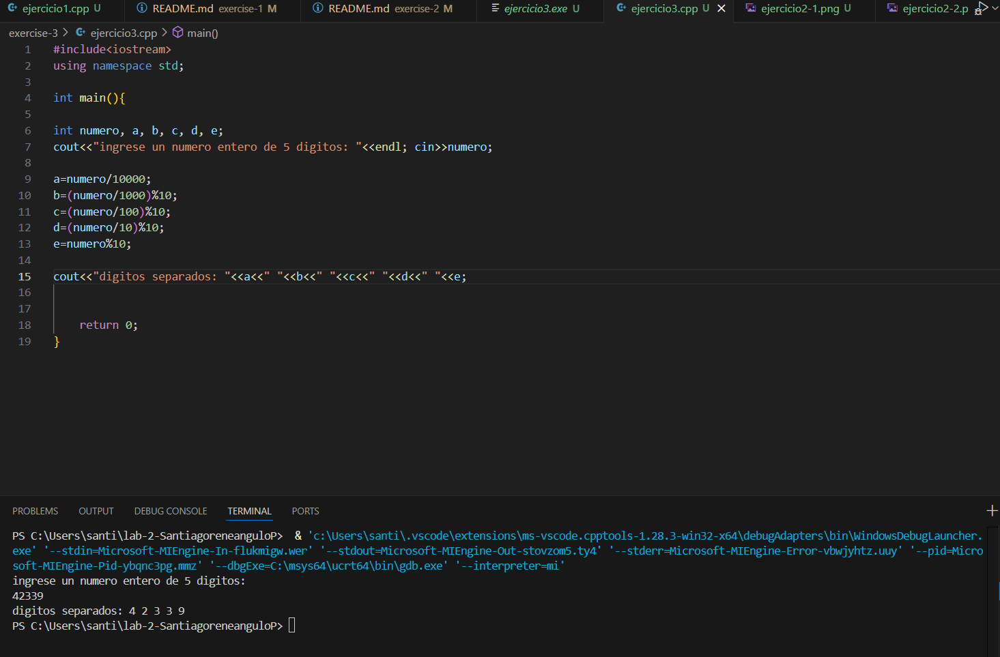

# Ejercicio de laboratorio 3 - Separación de dígitos

## Descripción

Escriba un programa que ingrese un número de cinco dígitos, divida el número en sus dígitos individuales e imprima los dígitos separados entre sí por tres espacios cada uno. [Sugerencia: use la división entera y el operador de módulo.] Por ejemplo, si el usuario ingresa 42339, el programa debe imprimir lo que se muestra en la salida de ejemplo.

```cmd
Introduzca un número entero de cinco dígitos: 42339
Dígitos separados: 4 2 3 3 9
```

## Contesta las siguientes preguntas

1. ¿Cuáles son los resultados de las siguientes expresiones?

   | Operación  | Resultado |
   | ---------- | --------- |
   | 24 / 5     | 4        |
   | 18 % 3     | 0         |
   | 13 % 9     | 4        |
   | 13 / 2 % 2 | 0         |

2. ¿Qué sucede cuando el usuario ingresa un número que tiene menos de cinco dígitos? ¿Por qué? ¿Cuál es la salida cuando se ingresa 1763? Se le grega un 0, la salida es: 1763

3. El programa que completó en este ejercicio de laboratorio ingresa un número con varios dígitos y separa los dígitos. Escribe un programa inverso, un programa que le pide al usuario tres números de un dígito y los combina en un solo número de tres dígitos.

## ✅ Resultado

(Añadir captura de pantalla del resultado de la ejecución)





